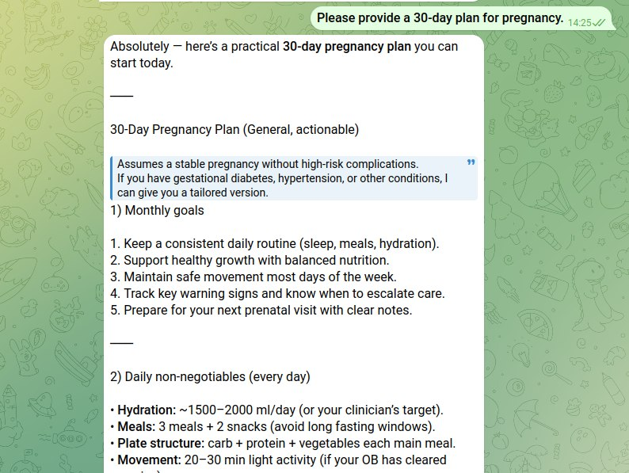

# Maternal Infant Care Skill (OpenClaw)

Practical bilingual skill pack for maternal and infant care (preconception to 0-3 years).

[中文说明](README_zh.md)

## Highlights

- Real operational playbooks (not just outlines)
- Risk triage first: urgent / same-day / home-monitoring
- 30-day executable plans (weekly + daily logs)
- Nutrition and meal-generation rules
- Newborn fever SOP and doctor-summary templates

## References structure

- `references/zh/` — full Chinese library (expanded practical modules)
- `references/en/` — core English operational modules
- `references/*/evidence-map.md` — guideline/evidence anchoring (WHO/ACOG/AAP/NICE/CDC)

## Install

```bash
cp -r maternal-infant-care <your-workspace>/skills/
```

## Use examples

- “I’m 28 weeks pregnant, make a 30-day plan (diet, routine, monitoring, follow-up).”
- “My 2-month infant has fever 38.1°C, what should I do now?”
- “Build a 4-week GDM menu plan I can actually cook in 30 minutes/day.”

## Preview



## Safety

Educational and triage support only. Not a replacement for medical diagnosis.
Red-flag symptoms require urgent professional care.
